# 📦 Inventory Management System on AWS

A production-style Inventory Management System built with **Flask** and deployed on **Amazon Web Services (AWS)**. This project demonstrates high availability, scalability, monitoring, secure access, and backup strategies using core AWS services.

---

# 🏗️ AWS Architecture

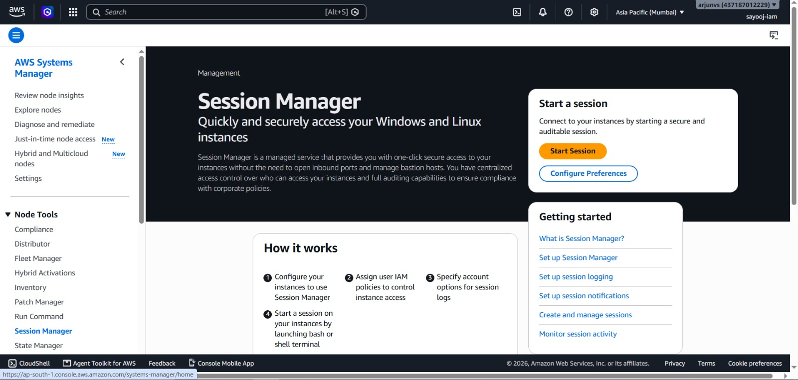

---

# 📌 Project Overview

This application allows users to securely manage inventory through a web interface.

The application is deployed on Amazon EC2 behind an Application Load Balancer and Auto Scaling Group. Amazon RDS MySQL is used as the backend database, while Amazon CloudWatch and Amazon SNS provide monitoring and alerting. Database backups are stored in Amazon S3, and AWS Systems Manager Session Manager is used for secure administration.

---

# 🚀 Features

- User Login Authentication
- Inventory Management
- Product Management (CRUD)
- Responsive Bootstrap UI
- Amazon RDS MySQL Database
- Application Load Balancer
- Auto Scaling Group
- CloudWatch Monitoring
- SNS Email Alerts
- Database Backup to Amazon S3
- Secure EC2 Access using Session Manager

---

# ☁️ AWS Services Used

| AWS Service | Purpose |
|-------------|---------|
| Amazon EC2 | Host Flask application |
| Application Load Balancer | Distribute incoming traffic |
| Auto Scaling Group | High availability |
| Amazon RDS | Managed MySQL database |
| Amazon S3 | Database backup storage |
| IAM | Secure role-based permissions |
| Amazon CloudWatch | Monitoring and alarms |
| Amazon SNS | Email notifications |
| AWS Systems Manager | Secure instance management |

---

# 📸 Application Screenshots

## Login Page

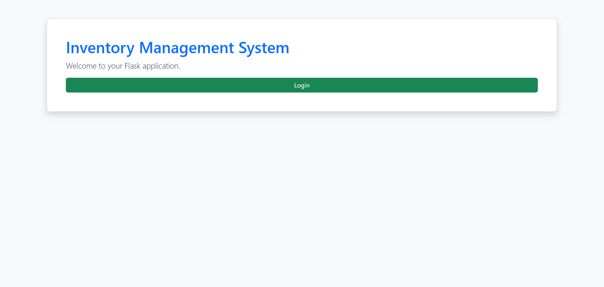

## Dashboard

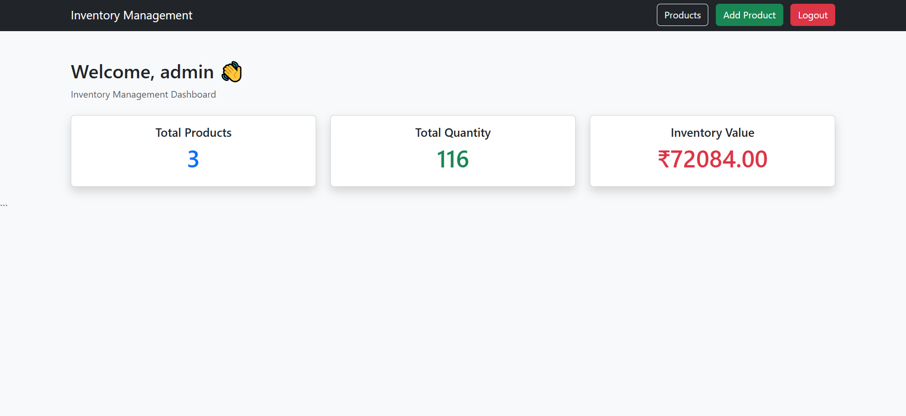

## Add Products

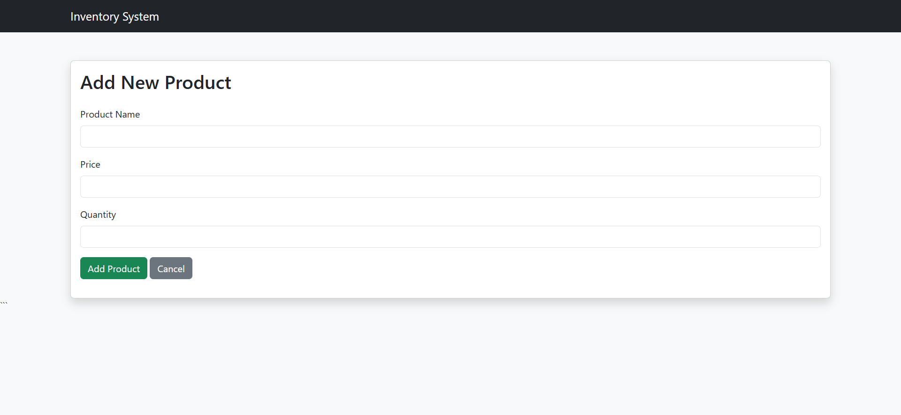

---

# ☁️ AWS Infrastructure

## EC2

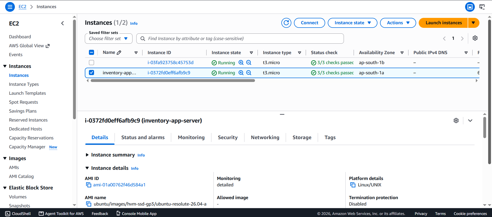

## Application Load Balancer

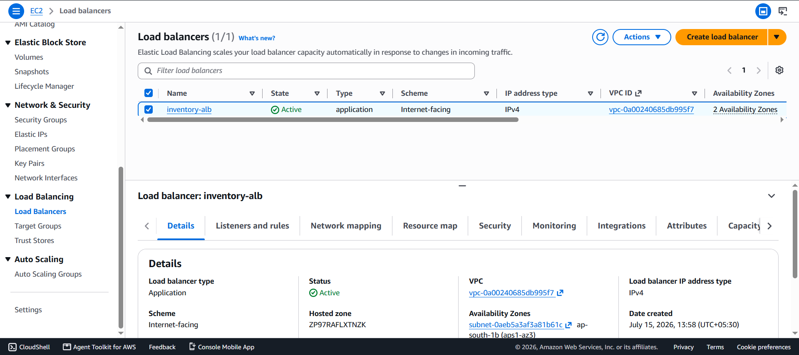

## Auto Scaling

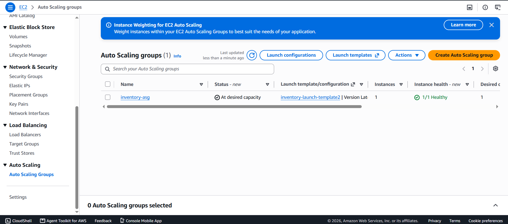

## Amazon RDS

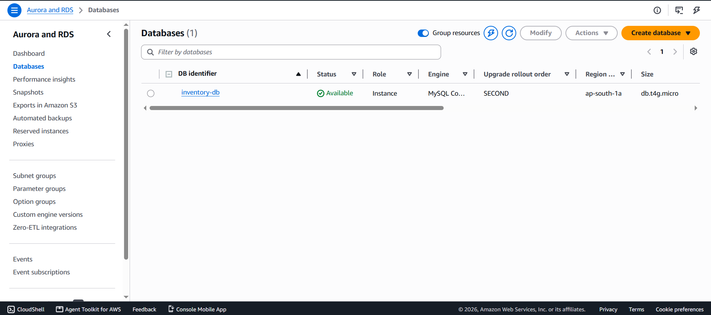

## CloudWatch

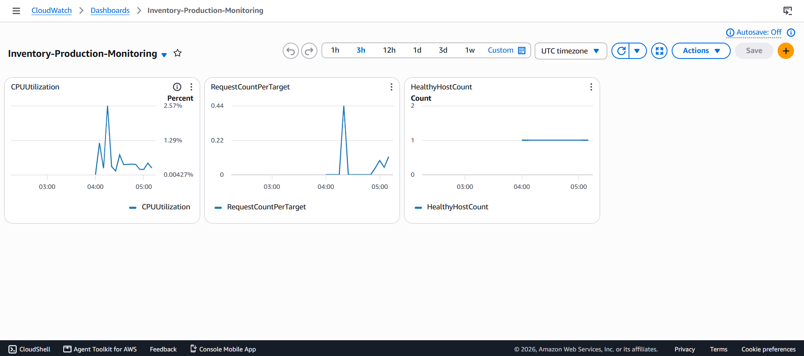

## Amazon SNS

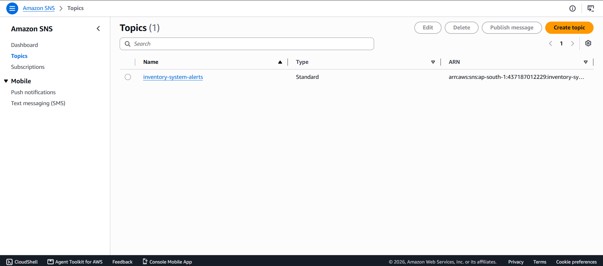

## Amazon S3 Backup

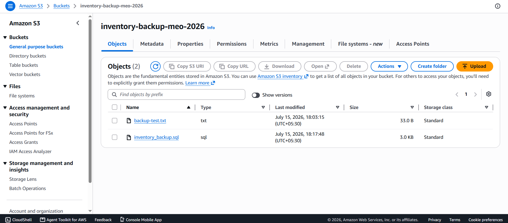

## Managed Nodes

## Session Manager

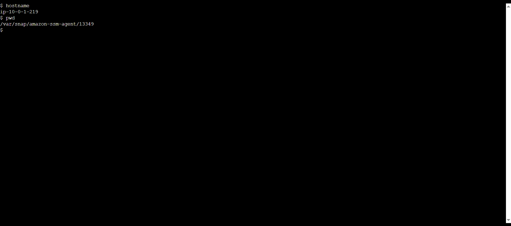

---

# 🔒 Security

- IAM Roles
- Least Privilege Access
- Systems Manager Session Manager
- Amazon RDS
- Security Groups

---

# 📊 Monitoring

- CloudWatch Metrics
- CloudWatch Alarms
- Amazon SNS Email Notifications

---

# 💾 Backup Strategy

- MySQL database backup using `mysqldump`
- Backup uploaded to Amazon S3 using an IAM role
- Backup restoration supported

---

# 🛠️ Technologies Used

- Python
- Flask
- Gunicorn
- Bootstrap
- MySQL
- Ubuntu Linux
- AWS

---

# 🎯 Skills Demonstrated

- AWS EC2
- Amazon RDS
- Application Load Balancer
- Auto Scaling
- Amazon S3
- IAM
- CloudWatch
- SNS
- Systems Manager
- Linux Administration
- Flask Deployment
